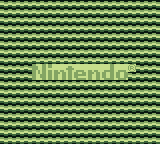

# gbdev-template [](https://brainmade.org/)



My Game Boy dev starting template inspired by [this video](https://www.youtube.com/watch?v=NSvGwmYPhAQ) by @systemoflevers as a starting point.

# Requirements (*nix only)

- [RGBDS](https://rgbds.gbdev.io/)
- `make`

# Usage

## Compilation

```sh
make
```

## Cleanup

```sh
make clean
```